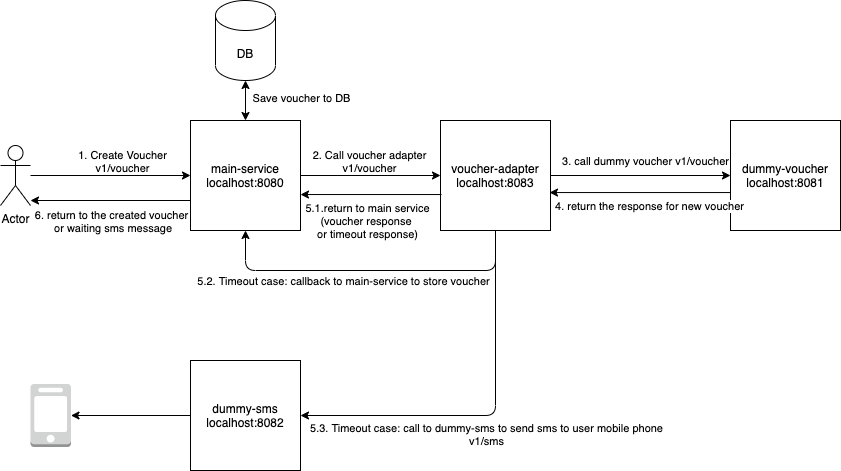
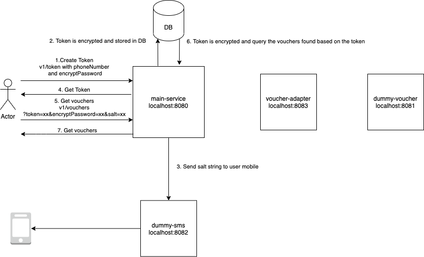
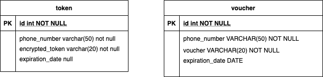

# assignment-Hoa Tran
- As this is just an assignment, I choose the most lightweight framework as it is, that's why I decide to choose h2 db, and direct calling between the services. In the real world, the dummy-sms and main-service or voucher-adapter can be interacted by a message queue.
- By the time limit, I haven't implemented the error message for invalid payload (missing mandatory fields), the dockerfile for all the services, and integrate code quality check service on github.

The system architect is shown as the below diagrams:

Create voucher flow:

Get voucher flow:

ERD:

How to run the system on local:
- Use intellij to open the following project as maven project: dummy-sms, dummy-voucher, main-service, voucher-adapter and start the spring application for all of them. Or these services can be started by mvn spring-boot:run
- To produce the timeout error, please change the code in dummy-voucher DummyVoucherServiceImpl, currently it is a random waiting time, so it can be randomly failed.

How to test the system on local:
These are the sample curl commands:
- Create voucher:
curl --location --request POST 'localhost:8080/v1/voucher' \
--header 'Content-Type: application/json' \
--data-raw '{
"phoneNumber": "12345",
"voucherServiceToken": "745fc5be-3f87-486f-90ed-5f71bcbb2ccd"
}'
- Create sms:
curl --location --request POST 'http://localhost:8082/v1/sms' \
--header 'Content-Type: application/json' \
--data-raw '{
"message": "abc"
}'
- Create token:
curl --location --request POST 'localhost:8080/v1/token' \
--header 'Content-Type: application/json' \
--data-raw '{
"phoneNumber": "12345",
"encryptPassword": "1234"
}'
-Get voucher:
curl --location --request GET 'localhost:8080/v1/vouchers?token=03c9a70a-b3a6-42e6-87b7-1ffc7390d968&encryptPassword=1234&salt=59ef7d6644a0bac1' \
--data-raw ''

There is also a post man script at: nab.postman_collection.json
